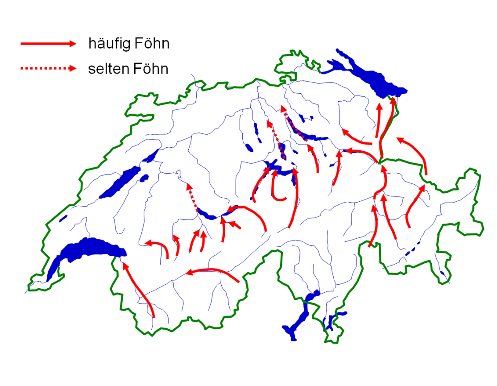

# Föhnflug-Handbuch

## Föhnkarte Schweiz

Quelle: [MeteoSchweiz](https://www.meteoschweiz.admin.ch/home/klima/klima-der-schweiz/altweibersommer-eisheilige-und-andere-spezialitaeten/foehn.html)

# Welleneinstieg

Vermutete / getestete Einstiegspunkte

* N Adelboden (4.12.2020/yg/3200m)/Albristhorn (?)
* Dreispitz (?)
* Melchsee/Frutt
* Schächental
* Klausenpass
* Linthal (4.12.2020/yg/3000m)
* Sernftal, Elm-Foostock
* Montafonwelle: Zimba-Schruns (2200m ?)
* Inntal: Über Bahnhof Hall/Tirol (CTR-Freigabe nötig!)
* Wildschönau (?) (3km S Wörgl)
* Hohe Salve (5km OSO Wörgl)
* Stripsenjoch (zwischen Wildem und Zahmen Kaiser)
* Kaprun (Pinzgau)

# Auffangpunkte/-linien

Punkte, an denen man bei Föhn relativ zuverlässig, teils auch 
in niedriger Höhe in den Hangwind einsteigen kann.  Sortiert 
von West nach Ost.

## Tabellenparameter

* h: Minimal empfohlene Ankunftshöhe, wo der Hang (normalerweise)
  funktioniert (m MSL)
* Landefelder: Landemöglichkeit, falls der Hang *nicht* funktioniert

## Hangflug Schweiz

### Südliche Route

Vorderrheintal-Oberalppass-Furkapass-Wallis

Nur möglich bei relativ trockenem Föhn und wenig bis keine Westkomponente
im Windfeld!

### Nördliche Route 

|Punkt | h | Landefeld(er) | Bemerkungen |
|---|:---:|---|---|
| Gross Lohner | 2600 | Reichenbach, Thun | N Gemmipass; Ostgrat anfliegen; nur bei Ostkomponente getestet |
| Dreispitz/Latrejespitz/First | 2400 | Reichenbach, Thun | S Thunersee |
| Jänzi | 1600 | Kägiswil | W Sarnen |
| Sädel-Hoch Gumme | 1600 | Kägiswil | W Lungerersee |
| Wendenstöcke | 2500 | Meiringen, Kägiswil | Grat N Gadmertal; Achtung TMA Meiringen |
| Urmiberg | 1200 | Buochs, Lauerz | Wind am Urner See beachten |
| Eggberge | 1000 | Altdorf | Wind am Urner See beachten | 
| Wiggis/Rautispitz | 1800 | Mollis, Schänis | |
| Gufelstock | 2000 | Mollis, Schänis | |
| Chäserrugg | 2000 | Schänis, Bad Ragaz | |
| Hüser (Säntis-Hoher Kasten) | 1500 | Hohenems | |
| Gonzen | 1000 | Sargans, Bad Ragaz | Nach Ragaz: Gegenwind, starkes Sinken! |
| Mazorakopf/Falknis | 2300 | Bad Ragaz | Vorsicht/höher anfliegen bei Ostkomponente! |
| Schesaplana-Drusenfluh-Sulzfluh | 2400 | Bad Ragaz | Sehr zuverlässig |
| Zimba | 2300 | Hohenems | Nach Süden östlich Lünersee fliegen |

## Hangflug Österreich

Inntal-Saalfelden-Ennstal-Mur/Mürz-Furche

|Punkt | h | Landefeld(er) | Bemerkungen |
|---|:---:|---|---|
|Valluga   | 2700 | Bludenz, Imst |  |
|Parseier  | 2500 | Imst | Richtung Mieminger: Achtung TMA Innsbruck Hahntenjoch |
|Venetberg| 1800 | Landeck/Zams, Mils | Hilfreich bei Absaufer |
|Heiterwand| 2500 | Imst, Innsbruck | |
|Rauchberg | 2300 | Imst, Innsbruck | Achtung: TMA Innsbruck Hahntenjoch |
|Mieminger | 2000 | Nassereith, Stams, Innsbruck | Oft Flaute?  Evtl. an Hochwanner zurückfallen lassen | 
|Seegrube  | 1200 | Innsbruck | Freigabe zur Aufwindsuche nötig oder TRA C aktiv  |
|Ochsenkopf  | | Innsbruck, Kufstein |  |
|Pendling | 1000 | Kufstein | Nur wenn Wind ins Tal durchkommt; Kufstein nach Wind fragen |
|Wilder Kaiser | 1700 | Kufstein, St. Johann |  |
|Mitterhorn/Grosses Ochsenhorn | 2000 (?) | St. Johann | Achtung: Tüpl Hochfilzen |
|Leoganger Steinberge/Birnhorn | | St. Johann, Saalfelden |  |
|Steinernes Meer | | Saalfelden, Zell am See | Nach Zell am See: Gegenwind! |
|Hochkönig | | St. Johann, Saalfelden |  |
|(Tennengebirge)| |  | Pfarrwerfen? |  |
|Dachstein| | Niederöblarn |  |

# Spezielle Föhnlagen

## Seichter Föhn

Seichter Föhn kann die hohen Berge nicht überströmen.  Charakteristisch
ist, dass der Wind in den einzelnen Föhntälern (Rheintal, Reusstal)
zwar stark bläst, nach oben hin jedoch wieder abnimmt. Dies oft auf unter
20km/h zwischen 2500m und 3500m.

Seichter Föhn scheint durchaus auch bei hoher Druckdifferenz vorkommen, 
wie zum Beispiel am 21. Oktober 2020 mit 12hPa Lugano-Zürich.  MeteoSchweiz hat einen
[interessanten Artikel](https://www.meteoschweiz.admin.ch/home/aktuell/meteoschweiz-blog.subpage.html/de/data/blogs/2020/10/foehntag.html) zu diesem
Thema veröffentlicht.

Lange Streckenflüge in seichtem Föhn sind schwierig, da Hänge oft nicht
tragen und Wellen nicht gut entwickelt sind.

Eine seichte Föhnlage ist am besten im vertikalen Windprofil zu erkennen
(zB MeteoBlue-Meteogramme).

# Flüge

* Bernhard Leitner, Innsbruck, 5.10.2020: 
  [OLC](https://www.onlinecontest.org/olc-3.0/gliding/flightinfo.html?dsId=8203468)
* Philipp Stahl, Kufstein, 26.10.2020:
  [OLC](https://www.onlinecontest.org/olc-3.0/gliding/flightinfo.html?dsId=8215817)
* Gerhard Wesp, Schänis, 3.10.2021:
  [WeGlide](https://www.weglide.org/flight/108402)
* Sigi Föhn, Schänis, 30.10.2021, Hangwind am Venetberg:
  [WeGlide](https://www.weglide.org/flight/111195)

# Vorhersagetools

* [Meteogramme von MeteoBlue](https://www.meteoblue.com/en/weather/aviation/air/)
* [Meteoseite des Flugplatzes Schänis](https://flugplatz-schaenis.ch/meteo/)

# Referenzen

* Lucian Haas, [Der wohltemperierte Föhn](https://lu-glidz.blogspot.com/2018/11/der-wohltemperierte-fohn.html).  Blog, 11/2018
